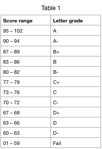

# Assessment

### Weight/Distribution of Course Points: 


Of 100 available points, 20 are given for the weekly "lightning talk" presentations of found images significantly altered by computation, 64 are given for completing the labs, and 16 are given for participating in debates.

### Final Grading Scale: 


The letter grade based on accumulated points. Grades for the different credit op1ons will be based on the following guide. NOTE that Scripps College does not recognize A+ grades.

### POINTS / GRADES

| Count | Activity | Description | Points |
| :--- | :--- | :--- | :--- |
| 8 | Labs | Submit documentation from classroom activities in electronic Google Colab Notebooks | 64 |
| 12 | Weekly “Lightning talk” presentations | Jupyter Lab in Google Colab Notebooks | 20 |
| 4 | Debates | Restage famous historical debates about vision, light, reality, and color. | 16 |
|  | **TOTAL** |  | **100** |

