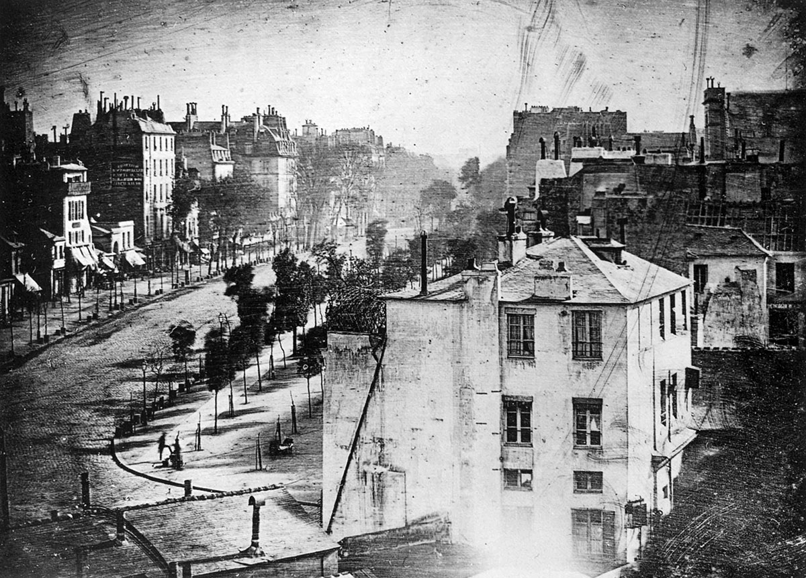

# Challenge Image 1: Daguerre

Let's discuss the distortions and artifacts that you see in this image. 

### Prompts

1. What do you see? 
2. Is there anything strange or mysterious about the image?
3. Where do the effects come from? Are they an accident?
4. What do the distortions add to the image? 



1. 2. 
