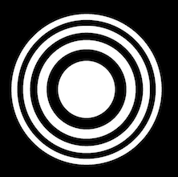

# Pinhole images

### Pinhole photography

A pinhole cut in a piece of metal will transmit a crisp flip-flopped image in a dark box. 

### Why?

Light waves interfere with one another like waves moving through any medium. This interference may be constructve or destructive. 

### Zone Plates

> A zone plate consists of a set of radially [symmetric](https://en.wikipedia.org/wiki/Symmetric) rings, known as [Fresnel zones](https://en.wikipedia.org/wiki/Fresnel_zone), which alternate between [opaque](https://en.wikipedia.org/wiki/Opacity_%28optics%29) and [transparent](https://en.wikipedia.org/wiki/Transparency_%28optics%29). Light hitting the zone plate will [diffract](https://en.wikipedia.org/wiki/Diffraction) around the opaque zones. The zones can be spaced so that the diffracted light constructively [interferes](https://en.wikipedia.org/wiki/Interference_%28wave_propagation%29) at the desired focus, creating an image there.

