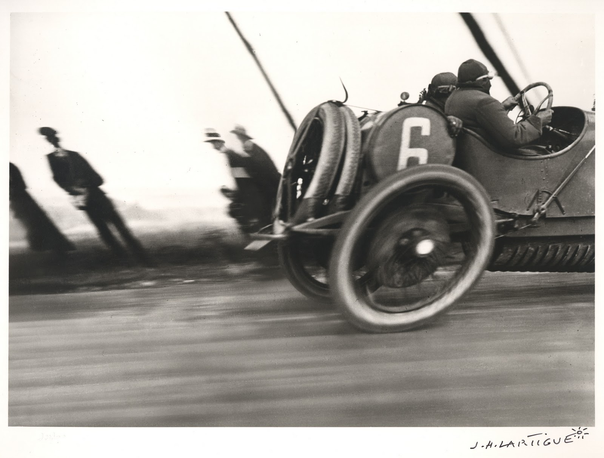

# Challenge Image \#2: Lartigue

### Mystery images

Can you tell what's going on with these images? No Photochop.

> This photograph is so appealing because of its distortions. The man at the side of the road is leaning to the left, while the hind wheel of the car is deformed to an oblique ellipse. The car is only half visible and together with the deformations it gives artistic power to the image: the speed of the car seems bigger because of the distorted wheel, as though it was a cartoon. The car is speeding out of the image. In the mean time, the left bystander falls sideways in a silent underwater world with which the race driver has no contact. Even the spokes of the wheel are bent in the driving direction, if you look carefully.
>
> **Landolfi, The Netherlands**

