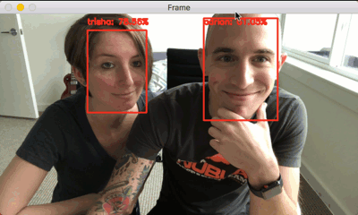

# LAB: Camouflage

Get into groups of 2-4. Each group will need a camera that can identify faces and put boxes around them. Your job is to camouflage the face from the camera.

You may want to try different strategies: blending in with the background, looking like another kind of animal, inversion, lenses, dazzle, etc. Try different approaches. The only rule is that you need to be properly lit.

You may find these web pages helpful in addition to this week's reading:

* [https://medium.com/@lancengym/how-to-beat-facial-recognition-ab118a0c37fd](https://medium.com/@lancengym/how-to-beat-facial-recognition-ab118a0c37fd)
* [https://www.dailymail.co.uk/sciencetech/article-4088076/The-anti-surveillance-clothing-hides-people-security-cameras-using-ghostly-patterns.html](https://www.dailymail.co.uk/sciencetech/article-4088076/The-anti-surveillance-clothing-hides-people-security-cameras-using-ghostly-patterns.html)
* [https://arxiv.org/pdf/1708.09317.pdf](https://arxiv.org/pdf/1708.09317.pdf)

#### Style Tips for Reclaiming Privacy \(from CV Dazzle\)

**Makeup** Avoid enhancers: They amplify key facial features. This makes your face easier to detect. Instead apply makeup that contrasts with your skin tone in unusual tones and directions: light colors on dark skin, dark colors on light skin.

**Nose Bridge** Partially obscure the nose-bridge area: The region where the nose, eyes, and forehead intersect is a key facial feature. This is especially effective against OpenCV's face detection algorithm.3 

**Eyes** Partially obscure one of the ocular regions: The position and darkness of eyes is a key facial feature.

**Head** Research from Ranran Feng and Balakrishnan Prabhakaran at University of Texas, shows that obscuring the elliptical shape of a head can also improve your ability to block face detection. Link: [Facilitating fashion camouflage art](http://dl.acm.org/citation.cfm?id=2502121)

**Asymmetry** Facial-recognition algorithms expect symmetry between the left and right sides of the face. By developing an asymmetrical look, you may decrease your probability of being detected.  

### From the other side: Disguised Face Identification \(DFI\) with Facial KeyPoints using Spatial Fusion Convolutional Network

_Disguised face identification \(DFI\) is an extremely challenging problem due to the numerous variations that can be introduced using different disguises. This paper introduces a deep learning framework to first detect 14 facial key-points which are then utilized to perform disguised face identification. Since the training of deep learning architectures relies on large annotated datasets, two annotated facial key-points datasets are introduced. The effectiveness of the facial keypoint detection framework is presented for each keypoint. The superiority of the key-point detection framework is also demonstrated by a comparison with other deep networks. The effectiveness of classification performance is also demonstrated by comparison with the state-of-the-art face disguise classification methods._

